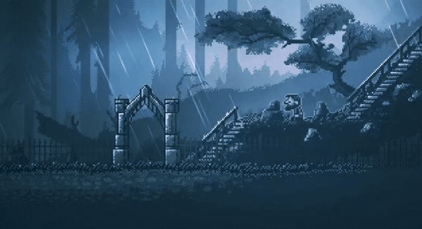
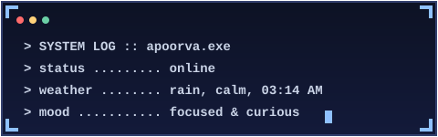

<div align="center">




<br/>



</div>

<br/>

<p align="center">
<a href="https://www.instagram.com/oriacgzz/" target="_blank"></a>&nbsp;&nbsp;
<a href="https://www.linkedin.com/in/apoorva-puranik-62702b273/" target="_blank"></a>&nbsp;&nbsp;
<a href="https://www.youtube.com/@eternal6590" target="_blank"></a>&nbsp;&nbsp;
<a href="mailto:papoorva25@gmail.com"></a>
</p>

</br>

## 💫 About Me

I'm **Apoorva**, an IT student who'd rather learn by shipping something than by reading about it. Most of what I know about backend systems and databases came from breaking my own projects and figuring out why — Java, Rust, and Python for the logic, MySQL and PostgreSQL for everything that needs to be remembered.

Lately I've been pulling AI into that mix, building small tools that actually do something rather than just demo well. Outside of code, I edit video and put together motion graphics in After Effects — a different kind of building, but the same instinct to keep making things.

- 🚀 Backend-leaning builder — APIs, data-driven systems, things with moving parts
- 🤖 Exploring how AI fits into real, usable applications
- 🎬 Video editing & motion graphics on the side
- 📚 Learn-by-building, always mid-experiment on something
- ⚡ Curious by default about how things work under the hood

<br/>

## 💻 Tech Stack

<p align="center">


</p>

<br/>

## 📊 GitHub Stats

<div align="center">


<br/>


</div>

<br/>

<div align="center">

</div>

<br/>

<div align="center">

```
> thanks for stopping by. stay dry out there. _
```

[](https://visitcount.itsvg.in)
[](https://visitcount.itsvg.in)

</div>
